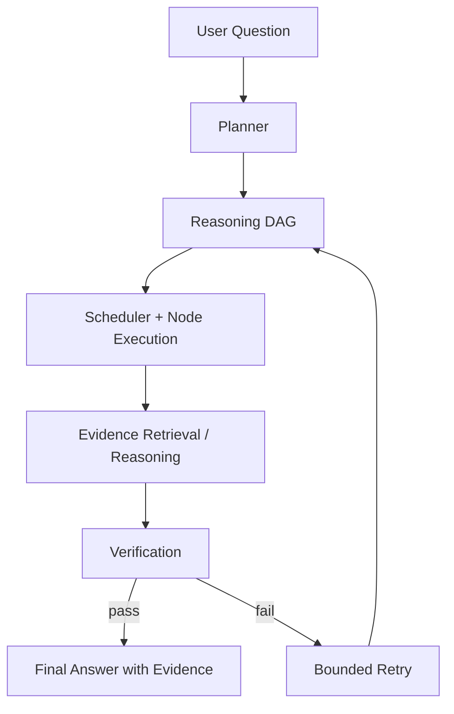
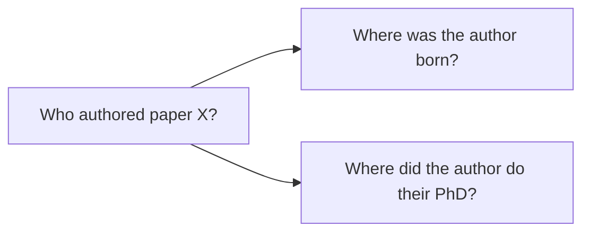
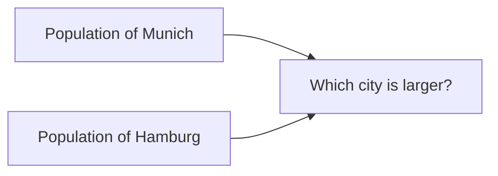
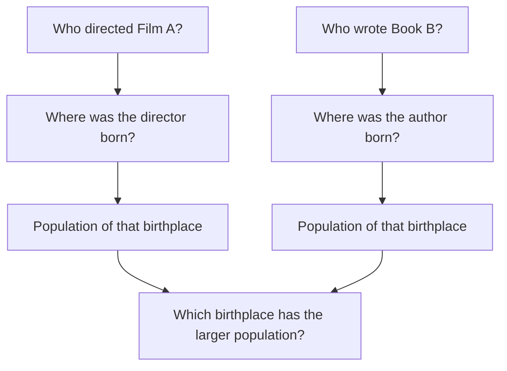

# Dependency-Aware Agentic RAG Architecture

## Goal

Build a RAG system that can answer **multi-hop questions** by decomposing them into smaller subquestions.

The main idea is that subquestions are not always independent. Some can run in parallel, while others depend on previous answers. Therefore, the system represents the reasoning process as a **directed acyclic graph (DAG)** instead of a flat list of questions.

---

## Motivation

Standard RAG usually works like this:

```text
question -> retrieve top-k chunks -> generate answer
```

This can fail for multi-hop questions because one retrieval step may miss important intermediate entities.

Example:

```text
Where did the author of paper X do their PhD?
```

To answer this, the system may first need to find:

```text
Who authored paper X?
```

Only then can it ask:

```text
Where did that person do their PhD?
```

So the system needs dependency-aware reasoning.

---

## Core Idea

The proposed system works as follows:

```text
question
-> decompose into subquestions
-> build dependency DAG
-> execute ready nodes
-> retrieve or reason
-> verify intermediate answers
-> fuse final answer
-> verify final answer
```

---

## System Overview

The MVP has five main stages:

```text
Question
  -> Build Reasoning DAG
  -> Execute Nodes
  -> Retrieve / Reason
  -> Verify
  -> Final Answer
```



The diagram intentionally hides implementation details. Internally, node execution may call a retriever, a reasoner, or a local expander, but for the MVP these are treated as part of one execution stage.

---

## Main Components

### 1. Planner

The planner decomposes the input question into subquestions.

Each subquestion becomes a node with:

- an ID,
- a question,
- dependencies,
- an operation type.

Example:

```json
{
  "id": "q2",
  "question": "Where did {q1.answer} do their PhD?",
  "depends_on": ["q1"],
  "operation": "retrieve"
}
```

The planner should identify whether the question is a bridge, comparison, temporal, causal, aggregation, or mixed multi-hop question.

---

### 2. Reasoning DAG

The DAG stores the subquestions and their dependencies.

A node can only run once all nodes it depends on have been answered.

Example:


The system uses a DAG instead of a tree because one answer can be reused by multiple later questions.



---

### 3. Scheduler and Node Execution

The scheduler decides which nodes can run next.

A node is ready only when all dependencies have been answered.

```python
def is_ready(node, state):
    return all(state[dep].status == "answered" for dep in node.depends_on)
```

Independent nodes can run in parallel:



Dependent nodes run sequentially:


Mixed questions can contain both patterns:


Here, the two branches can run in parallel, but each branch is sequential.

---

## Node Operations

Each node has one operation type:

| Operation | Description |
|---|---|
| `retrieve` | Search documents for evidence. |
| `reason` | Derive an answer from previous node outputs. |
| `compare` | Compare intermediate answers. |
| `expand` | Break a complex node into smaller nodes. |

---

## Self-Expanding Nodes

Some nodes may still be too complex to answer directly.

Example:

```text
Where did the author of paper X do their PhD?
```

This can be expanded into:


Expansion allows the system to handle nested multi-hop questions.

However, expansion must be bounded so the system does not grow indefinitely.

MVP limits:

```text
max_depth = 3
max_total_nodes = 12
max_repair_rounds = 2
```

---

## Retrieval

For the MVP, retrieval should start simple:

```text
query generation -> BM25 retrieval -> evidence extraction
```

Later, this can be extended with:

- dense vector search,
- hybrid retrieval,
- reranking,
- PDF/image/table ingestion.

Initial implementation should focus on text-only documents.

---

## Verification

The system uses two levels of verification.

### Local Verification

After each node, check:

- was the subquestion answered?
- is the answer supported by evidence?
- is the evidence relevant?

If the node fails, the system can retry retrieval or expand the node.

### Global Verification

Before returning the final answer, check:

- were all required nodes answered?
- does the final answer follow from the intermediate answers?
- is the final answer supported by retrieved evidence?

---

## Evaluation

The main evaluation should use established metrics so the system can be compared to standard RAG and multi-hop QA systems.

Custom DAG metrics are useful for analysis, but they should not be the main benchmark result.

---

## Baselines

| System | Description |
|---|---|
| Direct LLM | No retrieval. |
| Standard RAG | Single retrieve-then-answer step. |
| Iterative RAG / ReAct-style RAG | Repeated retrieve-reason loop. |
| Dependency-Aware Agentic RAG | Proposed system. |
| Oracle Retrieval | Gold evidence is provided. |

---

## Datasets

| Dataset | Use |
|---|---|
| HotpotQA | Multi-hop QA with supporting facts. | (primary set)
| HoVer | Multi-hop fact verification. |
| MultiHop-RAG | Realistic multi-document RAG benchmark. |
| MuSiQue | Harder multi-hop questions. |

For the MVP, we will start with a small subset of **HotpotQA** or **HoVer**.

---

## Primary Metrics

These are the main comparison metrics.

| Category | Metrics |
|---|---|
| QA accuracy | Exact Match, Answer F1 |
| Evidence quality | Supporting Fact F1, Joint F1 |
| Retrieval | Recall@k, MRR, nDCG@k |
| RAG quality | Faithfulness, Context Precision, Context Recall |

Recommended result table:

| System | EM ↑ | Answer F1 ↑ | Support F1 ↑ | Joint F1 ↑ | Recall@10 ↑ | MRR ↑ | Faithfulness ↑ |
|---|---:|---:|---:|---:|---:|---:|---:|
| Direct LLM | | | | | | | |
| Standard RAG | | | | | | | |
| Iterative RAG | | | | | | | |
| Dependency-Aware Agentic RAG | | | | | | | |
| Oracle Retrieval | | | | | | | |

---

## Secondary Diagnostics

These metrics explain the architecture but are not the main benchmark.

| Metric | Purpose |
|---|---|
| Average number of nodes | Measures graph complexity. |
| Average DAG depth | Measures decomposition depth. |
| Repair rate | Measures how often the system has to fix itself. |
| Latency | Measures runtime cost. |
| Token/tool cost | Measures efficiency. |
| Answer agreement | Measures stability over repeated runs. |

---

## MVP Scope

For the first version, implement:

1. text-only document ingestion,
2. BM25 retrieval,
3. planner that outputs subquestions and dependencies,
4. DAG scheduler,
5. node executor for `retrieve`, `reason`, and `compare`,
6. local verifier,
7. fusion step,
8. global verifier,
9. evaluation on a small HotpotQA or HoVer subset.

---

## First Demo

The first demo should show one full trace:

1. input question,
2. generated DAG,
3. execution order,
4. retrieved evidence per node,
5. final answer,
6. verification result.

Example question:

```text
Which birthplace has a larger population: the birthplace of the director of Film A or the birthplace of the author of Book B?
```

Generated DAG:



Execution:

```text
Step 1: q1 and q4 run in parallel.
Step 2: q2 and q5 run after q1 and q4.
Step 3: q3 and q6 run after q2 and q5.
Step 4: q7 compares both populations.
Step 5: verifier checks the final answer.
```

---

## Summary

The proposed system is a **dependency-aware RAG agent**.

It decomposes complex questions into a reasoning DAG, executes independent nodes in parallel, handles dependent nodes sequentially, retrieves evidence for atomic facts, and verifies the final answer against the retrieved evidence.

The main benchmark uses established QA, retrieval, and RAG metrics. Custom DAG metrics are only used as diagnostics.
